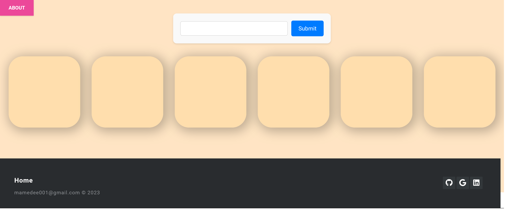

## [Recommend Artist](https://marl-am.github.io/)

Front page

After entering the name of an artist, ypur results will be shown.
By clicking on an artist, you are sent to their Spotify page

Python Dependencies
* flask
* spotipy
* python-dotenv

Instructions
* In the terminal type "cd client" click enter then type in "npm install" and click enter.
* Now type in "cd .." to get to the root folder then "cd flask-server" folder and create the .env file or edit and rename the ".env.example" I included in the flask-server folder. Add the variables "SPOTIFY_CLIENT_ID" and  "SPOTIFY_CLIENT_SECRET". You can gain the client id and client secret from the Spotify Web Api.

* Install the python dependencies

* In the flask-server folder type "python server.py" in the terminal and click enter, then return to the client folder and type into the terminal "npm start"